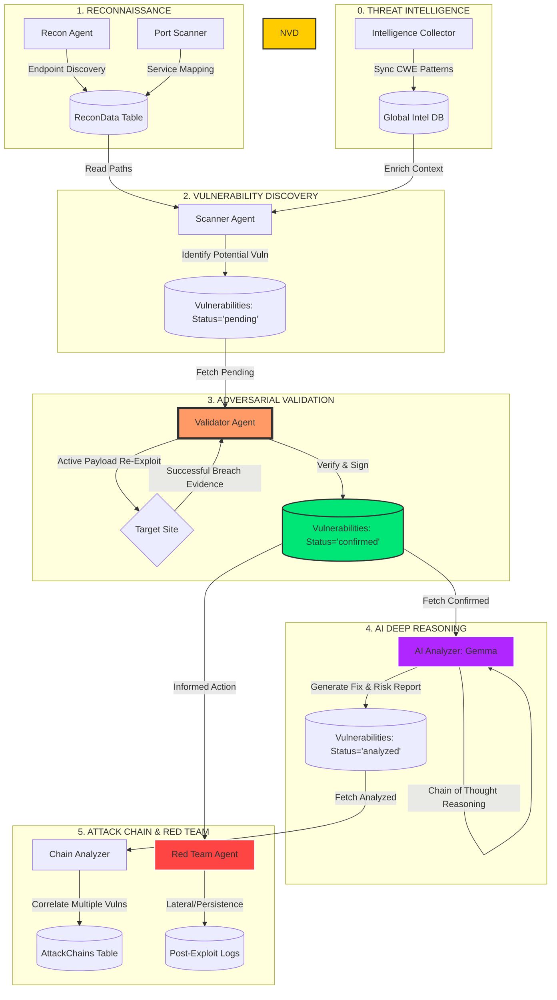

# Shivam OS: Agent Intelligence & Validation Architecture

This document provides a technical breakdown of the autonomous data flow, threat intelligence integration, and validation logic within the Shivam OS ecosystem.

---

## 🛰️ Data Flow & Validation Lifecycle

Shivam OS does not use linear, point-to-point data passing. Instead, it utilizes an **Event-Driven Shared State** model. The pipeline is enhanced by a continuous **Vulnerability Intelligence Feed** (CWE Patterns sync) that informs agents during the discovery phase.

---

## 🛠️ Detailed Component Roles

### 0. Vulnerability Intelligence (Foundation)
The **Intelligence Collector** periodically synchronizes the local database with curated CWE patterns and attack signatures. This provides:
- **CWE Context**: Matching discovered services and behaviors to known weakness patterns.
- **Remediation Intelligence**: Providing developer-centric fixes based on established CWE mitigations.
- **Description Parsing**: AI-driven extraction of product info from raw CVE descriptions to improve fingerprinting.

### 1. The Scanner (Discovery)
The Scanner reads discovery data from the `ReconData` table. It performs non-destructive probes to find indicators of vulnerabilities. Any hit is logged as **`pending`**. At this stage, the finding is treated as a "Suspect."

### 2. The Validator (Execution)
The Validator is a high-confidence agent. It takes **`pending`** findings and attempts to re-execute the exploit using more aggressive or refined payloads. 
- **If the exploit succeeds**: The status is updated to **`confirmed`**.
- **If the exploit fails**: The status is updated to **`rejected`**.
This phase ensures that the final report has a **0% False Positive** rate.

### 3. The AI Analyzer (Intelligence)
The Analyzer uses **Gemma (Local LLM)** to perform deep reasoning on **`confirmed`** findings. It doesn't just restate the vulnerability; it performs a **Chain of Thought (CoT)** analysis to explain the specific business impact and provides a custom remediation plan. Once analysis is complete, the status is **`analyzed`**.

### 4. The Chain Analyzer (Strategy)
The final layer correlates independent `analyzed` findings. For example, it might link an *Information Disclosure* finding with a *Weak Authentication* finding to demonstrate a complete **Attack Path** from unauthenticated visitor to administrative access.

### 5. Red Team Operations (Post-Exploitation)
Triggered by confirmed high-severity vulnerabilities, these agents simulate adversarial behavior:
- **Lateral Movement**: Testing for credential reuse or service misconfigurations to pivot.
- **Persistence Auditing**: Identifying areas where an attacker could maintain long-term access.

---

## 📋 Data State Transitions

| Agent | Input State | Output State | Action |
| :--- | :--- | :--- | :--- |
| **NVD Collector** | API Source | Global Intel | Continuous Synchronization |
| **Scanner** | ReconData | `pending` | Initial Discovery |
| **Validator** | `pending` | `confirmed` / `rejected` | Active Verification |
| **AI Analyzer** | `confirmed` | `analyzed` | Risk Assessment & Remediation |
| **Chain Analyzer**| `analyzed` | Attack Chain | Strategic Correlation |
| **Red Team** | `confirmed` | Post-Exploit Evidence | Adversarial Simulation |
